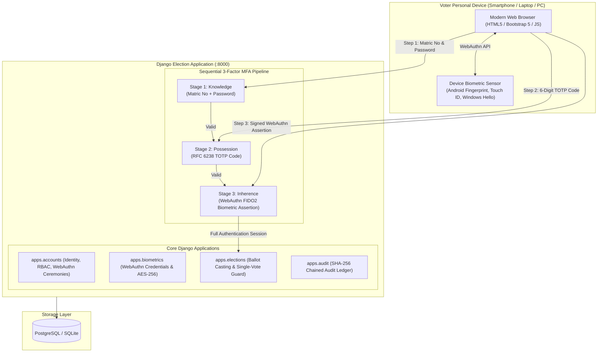

# ATBU E-Voting System

Secure, web-based university election system for Abubakar Tafawa Balewa University (ATBU) built with **Python (Django)** and **WebAuthn (FIDO2)**. Enforces sequential 3-factor authentication (**Password -> TOTP -> Personal Device Fingerprint**) allowing students to securely vote from anywhere using their smartphones, laptops, or tablets, backed by a tamper-evident SHA-256 chained audit ledger.

---

## 1. System Architecture



---

## 2. Multi-Factor Authentication Architecture

| Factor Tier | Category | Technology & Standard | Security Function |
|---|---|---|---|
| **Factor 1** | **Knowledge** | Django PBKDF2 / bcrypt | Password authentication with rate-limiting and auto-lockout after 5 failed attempts. |
| **Factor 2** | **Possession** | RFC 6238 TOTP (`pyotp`) | 6-digit dynamic passcode generated via authenticator apps (Google Authenticator, Authy). |
| **Factor 3** | **Inherence** | WebAuthn / FIDO2 (`webauthn`) | Cryptographic assertion using the voter's built-in personal device fingerprint hardware. |
| **Integrity** | **Tamper-Evidence** | SHA-256 Chained Block Ledger | Every security event and cast ballot is cryptographically linked to the Genesis Block. |

---

## 3. Quick Start Guide

### Prerequisites
- Python 3.10+
- Dependencies: `pip install -r requirements.txt`

### Step 1: Initialize Database & Apply Migrations
```bash
python manage.py makemigrations accounts biometrics elections audit
python manage.py migrate
```

### Step 2: Seed Sample University Elections & Accounts
```bash
python seed_data.py
```

### Step 3: Run the Development Server
```bash
python manage.py runserver
```
Access the voting portal at: [http://localhost:8000](http://localhost:8000)

*Note: Personal device fingerprint authentication runs directly through the browser using WebAuthn. No external agent or secondary server is needed.*

---

## 4. Sample Test Accounts

| Role | Matriculation / Staff ID | Password | Biometric / MFA Status |
|---|---|---|---|
| **Student 1 (CS, 400L)** | `20/54321U/1` | `VoterPass123!` | TOTP active / Enroll device fingerprint on first login |
| **Student 2 (CS, 300L)** | `21/65432U/1` | `VoterPass123!` | TOTP active / Enroll device fingerprint on first login |
| **Student 3 (CS, 200L)** | `22/76543U/1` | `VoterPass123!` | TOTP active / Enroll device fingerprint on first login |
| **Student 4 (CS, 100L)** | `23/87654U/1` | `VoterPass123!` | TOTP active / Enroll device fingerprint on first login |
| **UNECO Admin** | `ATBU/ADMIN/001` | `AdminSecret2026!` | UNECO Electoral Committee Command Center Access |

---

## 5. Active University Elections (2025/2026 Session)

1. **Student Union Government (SUG) General Election**:
   - President
   - Vice President
   - Secretary General
   - Assistant Secretary General
   - Financial Secretary
   - Director of Socials
   - Director of Welfare
2. **Nigeria Association of Computing Students (NACOS) Election**:
   - President
   - Vice President
   - General Secretary
   - Financial Secretary
   - Director of Software & Technical

---

## 6. Running Automated Tests

Run the complete test suite verifying WebAuthn ceremonies, MFA sequential gating, security attacks, and audit chain integrity:

```bash
# Run all tests
python manage.py test tests

# Run WebAuthn tests specifically
python manage.py test tests.test_webauthn
```

### Test Coverage Highlights:
- `test_webauthn.py`: WebAuthn registration options, authentication options, session binding, and credential models.
- `test_mfa_pipeline.py`: Stage 1 -> Stage 2 -> Stage 3 sequential enforcement.
- `test_security_attacks.py`: Stage-skipping bypass rejection, unauthenticated voting prevention, and double-voting blocks.
- `test_biometrics.py`: AES-256 GCM encryption at rest, matching algorithms, and FAR/FRR metrics.
- `test_audit_chain.py`: Genesis block initialization, sequential SHA-256 hash calculation, and automated tamper detection.

---

## 7. Security and Privacy Design

- **Zero Biometric Exposure**: Raw fingerprint images or biometric templates are never captured or transmitted across the network. All biometric verification happens inside the voter's device hardware secure enclave (FIDO2).
- **Public Key Cryptography**: The server stores only the public key (`WebAuthnCredential`) and monotonically increasing signature counter (`sign_count`) to eliminate replay attacks.
- **Auditable Ledger**: Every ballot produces a cryptographic hash receipt and appends an immutable block to the audit ledger.
